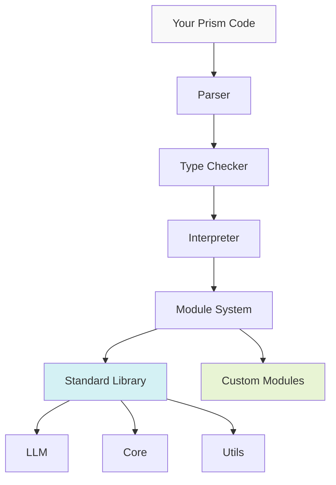
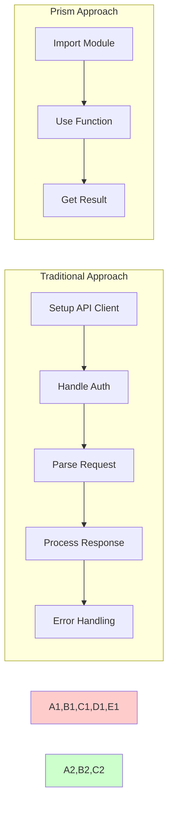

<div align="center">
  <h1>🌈 Prism Programming Language</h1>
  <p><strong>A modern language designed for the AI-first world</strong></p>
</div>

Prism is a programming language that bridges the gap between traditional software development and AI capabilities. It provides native support for LLM operations while maintaining the robustness and familiarity of traditional programming languages.

```prism
import llm from "std/llm"

async fn analyze_sentiment(text: string) -> float {
    let result = await llm.analyze(text, {
        task: "sentiment",
        model: "gpt-4"
    })
    return result.score
}
```

## Why Prism?

- **🤖 AI-Native**: First-class support for LLM operations and AI model interactions
- **🧩 Modular**: Extensible module system for building domain-specific features
- **🔒 Type-Safe**: Strong type system with inference for reliable code
- **⚡ Async-First**: Built-in support for modern asynchronous programming
- **🛠️ Practical**: Familiar syntax for experienced developers, gentle learning curve for newcomers

## Features in Action

### 1. Native LLM Integration

```prism
// Chat with AI models as naturally as calling functions
let response = await llm.chat("Explain quantum computing")
```

### 2. Type-Safe AI Operations

```prism
type AnalysisResult {
    sentiment: float,
    topics: List<string>,
    summary: string
}

async fn analyze_text(input: string) -> AnalysisResult {
    return await llm.analyze(input)
}
```

### 3. Extensible Module System

```prism
// Import only what you need
import { analyze, classify } from llm
import { parse_json } from utils

// Create domain-specific functionality
async fn process_data(data: string) -> json {
    let result = await analyze(data)
    return parse_json(result)
}
```

## Quick Start

```bash
# Install Prism
cargo install prism-lang

# Create a new project
prism new my-project

# Run an example
prism run examples/hello.prism
```

## Architecture



## Documentation

📚 **[Language Guide](docs/guide/README.md)**
- Start here to learn Prism basics
- Step-by-step tutorials
- Best practices

🧩 **[Module System](docs/modules/README.md)**
- Understanding Prism's extensibility
- Creating custom modules
- Module organization patterns

📖 **[Standard Library](docs/stdlib/README.md)**
- Built-in modules and functions
- LLM integration features
- Utility functions

🔬 **[Examples](examples/README.md)**
- Real-world use cases
- Domain-specific examples
- Integration patterns

## Example: Traditional vs Prism Approach

Here's how Prism simplifies AI integration compared to traditional approaches:



## Project Status

Prism is under active development with a focus on:
- Expanding LLM integration capabilities
- Enhancing the module system
- Improving developer experience
- Building community tools and resources

## Community

- 💬 [Discord](https://discord.gg/prism) (Coming soon)
- 📣 [GitHub Discussions](https://github.com/oneirocom/prism/discussions)
- 📝 [Contributing Guide](CONTRIBUTING.md)

## License

MIT License - see [LICENSE](LICENSE) for details