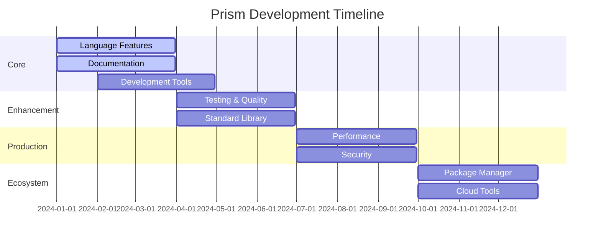

# 🗺️ Prism Roadmap

This document outlines the development roadmap for Prism, an AI-first programming language that introduces confidence flow, context management, and first-class LLM integration.

## 🎯 Current Focus (Q1 2024)

### TypeScript Integration (Priority)
- [x] WASM Bindings
  - [x] Core runtime implementation
  - [x] Value serialization/deserialization
  - [x] Error handling and type mapping
  - [x] Async operation support
- [x] TypeScript Package
  - [x] Type definitions and interfaces
  - [x] Runtime wrapper class
  - [x] Context management utilities
  - [x] Confidence flow helpers
- [x] Build System
  - [x] WASM build pipeline
  - [x] TypeScript compilation
  - [x] Package publishing workflow
- [x] Documentation
  - [x] TypeScript usage guide
  - [x] API reference
  - [x] Example integrations

### Core Language
- [ ] Complete Gemini LLM integration
- [ ] Improve async operation error handling
- [ ] Enhance type inference system
- [ ] Implement advanced pattern matching
- [ ] Add distributed context management
- [ ] Fix Send + Sync trait implementation for AST types
- [ ] Complete type checker implementation
- [ ] Add source locations to error messages

### Documentation
- [ ] Complete Getting Started Guide
- [ ] Write Standard Library API Reference
- [ ] Create Advanced Tutorials
- [ ] Write Deployment Guide
- [ ] Add Migration Guide
- [ ] Create Interactive Tutorials
- [ ] Improve Inline Documentation

### Development Tools
- [ ] Create VS Code Extension
- [ ] Implement Language Server Protocol
- [ ] Build Interactive Debugger
- [ ] Enhance REPL Functionality
- [ ] Create Performance Profiling Tools
- [ ] Add Auto-completion Support

## 🌟 Upcoming Features (Q2-Q4 2024)

### Q2 2024: Foundation Strengthening
- [ ] Testing Infrastructure
  - [ ] Add Property-based Tests
  - [ ] Increase Unit Test Coverage
  - [ ] Implement Integration Tests
  - [ ] Create Benchmark Suite
  - [ ] Add Fuzzing Tests

- [ ] Standard Library Expansion
  - [ ] Complete Core Utilities
  - [ ] Add More LLM Providers
  - [ ] Implement Tensor Operations
  - [ ] Add Advanced Context Utilities
  - [ ] Create Common Patterns Library

### Q3 2024: Performance & Security
- [ ] Performance Optimization
  - [ ] Optimize Interpreter
  - [ ] Implement Confidence Calculation Caching
  - [ ] Add Context Pooling
  - [ ] Optimize Memory Usage
  - [ ] Add Parallel Processing Support

- [ ] Security Enhancements
  - [ ] Implement Prompt Injection Prevention
  - [ ] Add Confidence-based Security Measures
  - [ ] Create Audit Logging System
  - [ ] Add Secure Context Isolation
  - [ ] Implement Encryption Utilities

### Q4 2024: Ecosystem Growth
- [ ] Package Manager for Prism Modules
- [ ] Web Playground Implementation
- [ ] Cloud Deployment Tools
- [ ] Enterprise Monitoring Features
- [ ] Community Template System

## 🏆 Completed Milestones

### Core Features ✅
- [x] Basic Parser Implementation
- [x] AST Structure
- [x] Interpreter Foundation
- [x] Basic Type System
- [x] Async/Await Support
- [x] Basic Module System
- [x] Initial LLM Integration

### Documentation ✅
- [x] Language Specification
- [x] Basic Examples
- [x] Contributing Guidelines
- [x] Security Guide
- [x] Performance Guide
- [x] Debugging Guide

## 📊 Progress Tracking

## 🤝 Contributing

We welcome contributions in all areas! Here's how to get started:

1. **Pick a Task**: Choose from any unchecked items above
2. **Discuss**: Open an issue to discuss your planned contribution
3. **Implement**: Fork, implement, and submit a pull request
4. **Review**: Address review feedback and get merged

See [CONTRIBUTING.md](CONTRIBUTING.md) for detailed guidelines.

## 📝 Notes

- Timelines are estimates and may adjust based on progress
- Priorities may shift based on community feedback
- Features may be added or modified based on real-world usage
- Regular updates will be made to this roadmap