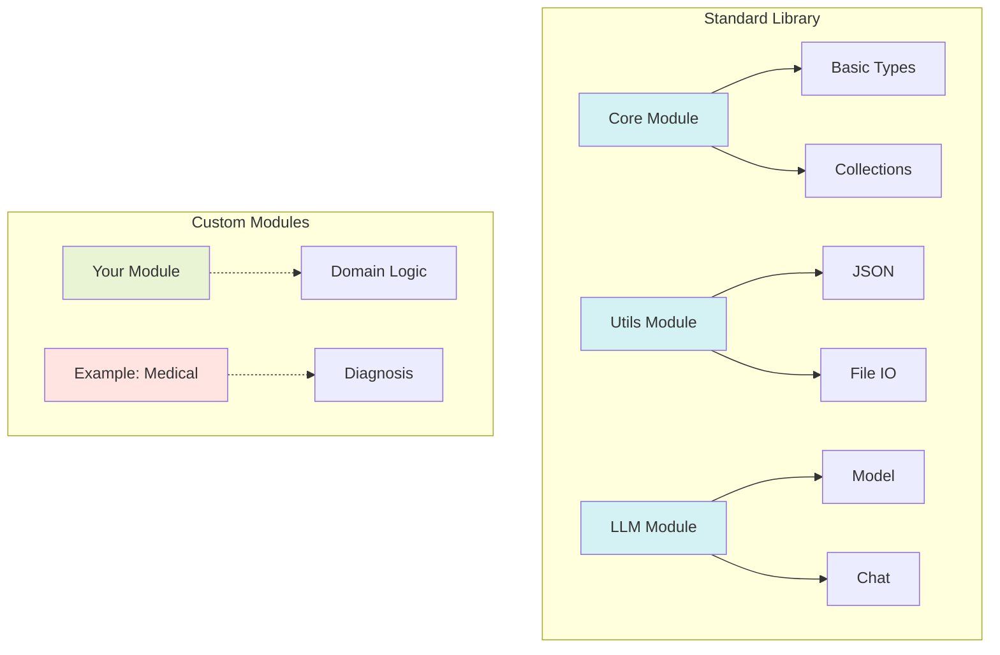
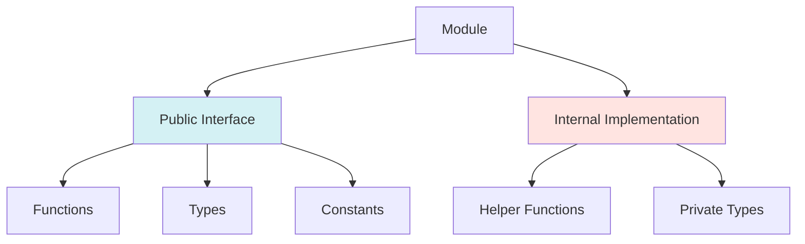
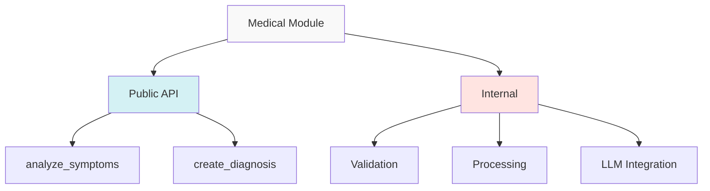

# Prism Module System

The module system is one of Prism's most powerful features, allowing for easy extension and organization of code.

## Architecture Overview



## Core Concepts

### Module Structure

A Prism module is a collection of related functionality that can include:
- Functions
- Types
- Constants
- Sub-modules

### Built-in Modules

Prism comes with several essential built-in modules:

```prism
import core from "std/core"   // Basic language functionality
import utils from "std/utils" // Common utilities
import llm from "std/llm"     // LLM integration
```

## Creating Custom Modules

### Module Definition

```rust
pub fn create_custom_module() -> Module {
    let mut module = Module::new("custom");
    
    // Register functions
    module.register_function("example", 
        Value::NativeFunction(Arc::new(|args| {
            // Implementation
        }))
    );
    
    module
}
```

### Using Custom Modules

```prism
import { example } from custom

fn main() {
    let result = example()
}
```

## Best Practices

### Module Organization



1. **Single Responsibility**: Each module should have a clear, focused purpose
2. **Logical Grouping**: Group related functionality together
3. **Clear Interface**: Expose a well-defined public API

### Module Dependencies

```prism
// Good: Clear dependencies
import { parse_json } from utils
import { analyze } from llm

// Avoid: Importing everything
import * from utils  // Not recommended
```

## Advanced Features

### Async Module Functions

```rust
module.register_function("async_example", 
    Value::AsyncFn(Arc::new(|args| {
        Box::pin(async move {
            // Async implementation
        })
    }))
);
```

### Type Registration

```rust
module.register_type("CustomType", TypeInfo {
    // Type definition
});
```

## Example: Building a Domain-Specific Module

The medical diagnosis module serves as an example of how to build domain-specific functionality:



### Implementation Example

```prism
// Example domain-specific module usage
import medical from "./examples/medical"

async fn diagnose(symptoms: string) -> Diagnosis {
    return await medical.analyze(symptoms)
}
```

## Testing Modules

```rust
#[test]
fn test_module() {
    let module = create_custom_module();
    assert!(module.has_function("example"));
}
```

## Module Development Guidelines

1. **Documentation**: Document all public interfaces
2. **Error Handling**: Use Result types for operations that can fail
3. **Testing**: Write unit tests for module functionality
4. **Performance**: Consider lazy loading for resource-intensive operations

For more information:
- [Standard Library Reference](../stdlib/README.md)
- [Language Guide](../guide/README.md)
- [API Reference](../api/README.md)