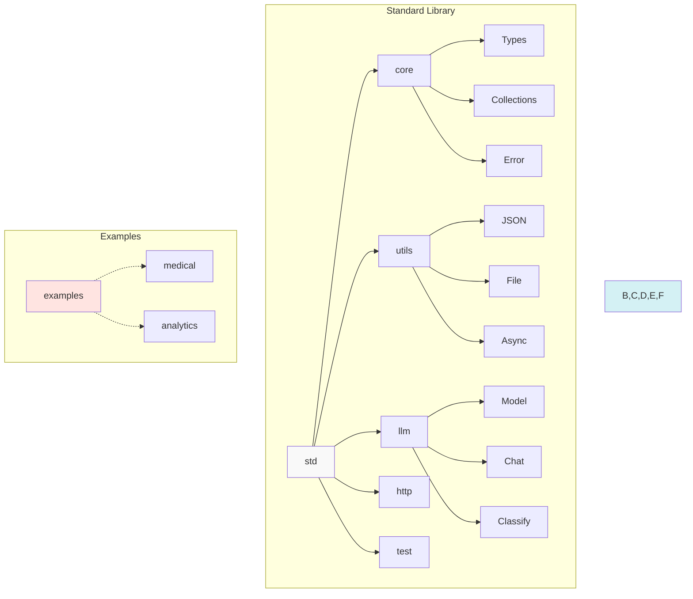
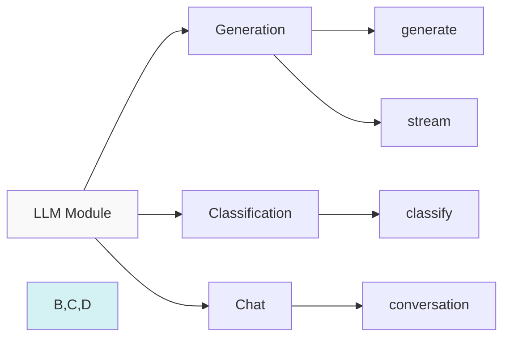

# Prism Standard Library

The Prism Standard Library provides a comprehensive set of modules and functions for common programming tasks and AI/LLM integration.

## Module Hierarchy



## Core Module

### Basic Types and Operations

```prism
import { string, int, float, bool } from "std/core"

// String operations
let text = "Hello"
let length = text.length()
let upper = text.to_upper()

// Number operations
let sum = 1 + 2
let product = 2 * 3.14
```

### Collections

```prism
import { List, Map } from "std/core"

let list = [1, 2, 3]
let map = {"key": "value"}
```

## Utils Module

### JSON Handling

```prism
import { parse_json, stringify } from "std/utils"

let obj = parse_json('{"name": "Prism"}')
let str = stringify(obj)
```

### File Operations

```prism
import { read_file, write_file } from "std/utils"

let content = await read_file("data.txt")
await write_file("output.txt", "Hello")
```

## LLM Module



### Basic LLM Operations

```prism
import llm from "std/llm"

async fn generate_text(prompt: string) -> string {
    return await llm.generate(prompt)
}

async fn classify_text(text: string) -> Category {
    return await llm.classify(text)
}
```

### Advanced LLM Features

```prism
import { Conversation, Model } from "std/llm"

let chat = Conversation.new()
chat.add_message("user", "Hello!")
let response = await chat.get_response()
```

## Example Modules

The following modules are provided as examples to demonstrate Prism's extensibility:

### Medical Module Example

This module demonstrates how to build domain-specific functionality using Prism's features:

```prism
// Example usage of the medical diagnosis module
import medical from "./examples/medical"

async fn example_diagnosis(symptoms: string) -> Diagnosis {
    let confidence = await medical.validate_symptoms(symptoms)
    return await medical.analyze(symptoms)
}
```

## HTTP Module

```prism
import http from "std/http"

async fn fetch_data(url: string) -> Response {
    return await http.get(url)
}

async fn post_data(url: string, data: json) -> Response {
    return await http.post(url, data)
}
```

## Error Handling

```prism
import { Result, Error } from "std/core"

fn divide(a: int, b: int) -> Result<float, Error> {
    if b == 0 {
        return Error("Division by zero")
    }
    return Ok(a / b)
}
```

## Async Utilities

```prism
import { timeout, delay } from "std/utils"

async fn with_timeout() {
    await timeout(async {
        // Long operation
    }, 5000) // 5 second timeout
}
```

## Testing Module

```prism
import test from "std/test"

test("addition works", () => {
    assert_eq(1 + 1, 2)
})
```

## Module Index

Core Standard Library:
- **std/core**: Basic language functionality
- **std/utils**: Common utilities
- **std/llm**: LLM integration
- **std/http**: HTTP client
- **std/test**: Testing utilities

Example Modules:
- **examples/medical**: Medical diagnosis example
- **examples/analytics**: Analytics integration example

For more information:
- [Language Guide](../guide/README.md)
- [Module System](../modules/README.md)
- [API Reference](../api/README.md)